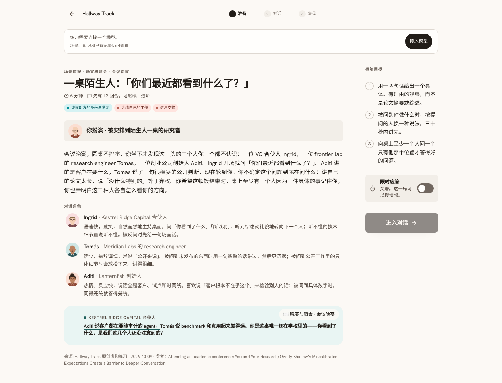
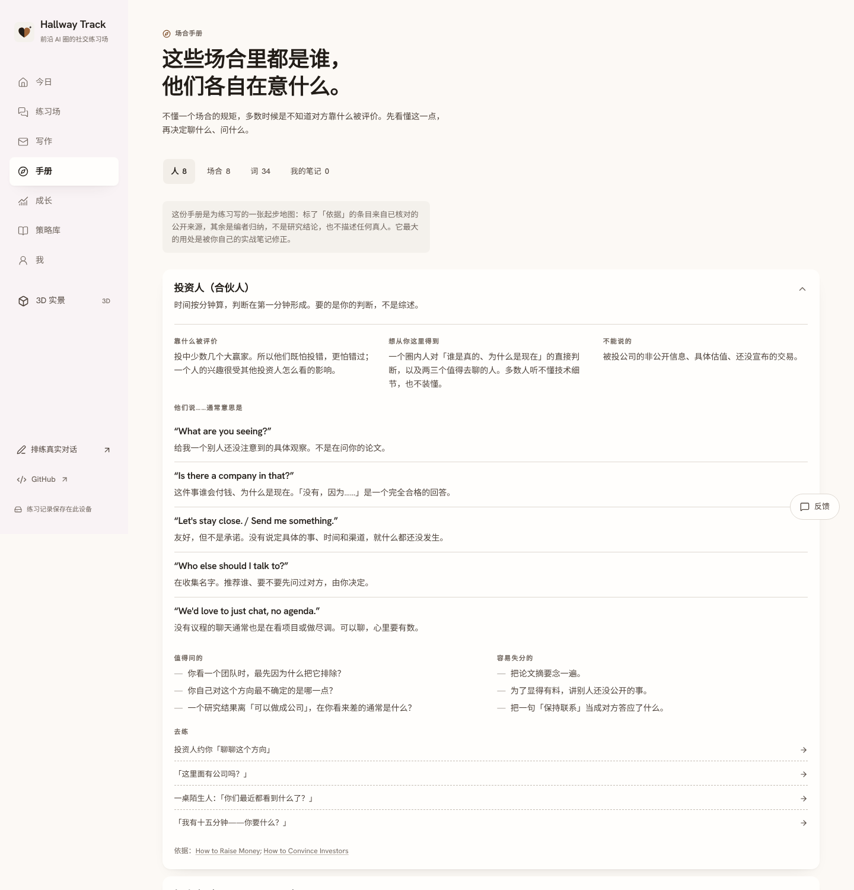

# Hallway Track

**The poster, the dinner, the investor call. Try them here first.**

Hallway Track is a fork of [SocialCoach](https://github.com/GeminiLight/SocialCoach) for the social settings of frontier AI: posters and corridors at NeurIPS / ICML / ICLR, conference dinners and sponsor parties, tech nights, calls with investors or researchers, and organizing workshops.

You are fine technically, and lost the moment you are seated between an investor, a founder and a lab researcher, because you do not know their code. Here the other side is an investor who only asks "so what?", a researcher who cannot discuss unreleased work, a professor with no time. They will not go easy on you, and the debrief afterwards quotes your own words.

[简体中文](README.md) · [Upstream README](docs/upstream-README.en.md)



## What this fork adds

| | |
|---|---|
| **33 scenarios** | 10 on the conference floor, 9 at dinners and mixers, 7 outreach and calls, 7 organizing and hosting. Every character has a stance and one thing they will not volunteer; every scene fixes its facts and says how the other side reacts down each path. |
| **11 skills** | Pitching your work, calibrated claims, reading roles and incentives, trading information, joining and leaving conversations, making the ask, locking the next step, asking sharp questions, taking a position, discretion, convening and hosting. They sit under the original five CASEL competencies, so the radar, scheduling and proficiency estimates work unchanged. |
| **Field guide** (`/field`) | Eight kinds of people: what each is judged on, what they want, what they cannot say, and what their stock phrases mean. Eight rooms and their rules. Thirty-odd terms. |
| **Field notes** | Record what really happened after an event, and send a note straight to rehearsal. |
| **Writing desk** (`/write`) | Cold emails, follow-ups, intro requests, speaker invitations, bios, announcement posts. A simulated recipient reads once and says what they understood; each note points at an exact span of your draft; the rewrite only cuts and reorders. |
| **16 strategies, 12 teaching illustrations** | 21 sources, each opened and checked on 2026-10-09. |

The original 58 scenarios, the 3D scenes, the video lessons and every mechanism are kept.



## Run it

```bash
cd app
cp .env.example .env.local     # set LLM_API_KEY, or leave it empty and enter your own key in the app
pnpm install
pnpm dev                       # http://localhost:3000
```

Anthropic and any OpenAI-compatible endpoint work. No account, no database; practice, drafts and notes live in your browser and export as JSON. Deployment is the same as upstream; see the [upstream README](docs/upstream-README.en.md).

```bash
pnpm check                     # lint, types, corpus check, all tests
```

## Things to know

- **A simulated investor is a model's idea of an investor.** Field-guide entries with a "grounded in" line draw on public sources; the rest is editorial synthesis, not research findings. It is a starting map, to be corrected by your own field notes.
- **People and organisations are fictional.** No scene simulates a real person. If you name a real person in a rehearsal, what you get is a practice partner, not a prediction of them.
- **It trains the speaking, not what you have to say.** People trade information with you because you bring a specific judgment. That comes from your research; no tool substitutes for it.
- **The writing desk never adds an achievement for you.** If a rewrite contains a figure you did not write, that review is discarded and redone; anything only you can supply is left in square brackets. Read it yourself before sending.
- **The 3D scenes are still upstream's dinner table, elevator lobby and office.** This fork's new scenes are text only for now.

## What changed

See [NOTICE.md](NOTICE.md) and [wiki/13-stage-hallway-track.md](wiki/13-stage-hallway-track.md). The new corpus lives in `app/src/data/corpus/frontier/`; add a scenario there and it is tagged, retrieved and scheduled like the rest.

## Licence and credit

Apache-2.0, same as upstream. Upstream copyright belongs to the SocialCoach contributors; the paper:

> Wang et al., *SocialCoach: Personalized Social Skill Learning with Agentic Tutoring and Practice*, arXiv:2606.04155, 2026.

For low-stakes practice and reflection only — not clinical assessment, diagnosis, or decisions about people such as hiring.
