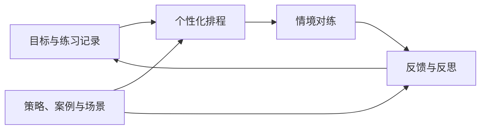

<div align="center">

<p align="left"><a href="https://www.hkust-gz.edu.cn/"><picture><source media="(prefers-color-scheme: dark)" srcset="docs/logos/hkust-guangzhou-dark.png"></picture></a>&nbsp;&nbsp;&nbsp;<a href="https://www.ustc.edu.cn/"></a></p>

<picture>
  <source media="(prefers-color-scheme: dark)" srcset="docs/banner-dark.svg">
  
</picture>

**你的专属 AI 情商教练。**

通过真实情境对练与个性化反馈，练习社交沟通，学会处理冲突。

[](https://socialcoach.aurax.live)
[](https://socialcoach-ai.vercel.app/3d)
[](https://arxiv.org/abs/2606.04155)
[](#交流与反馈)

酒桌劝酒、电梯尬聊、下班加活——尴尬先彩排。

[简体中文](README.md) · [English](README.en.md)

</div>

---

[News](#news) · [开始练习](#开始一场练习) · [3D 实景](#3d-实景练习) · [练习场景](#你可以练什么) · [核心功能](#核心功能) · [学习依据](#社交技能与社交情绪学习sel) · [本地运行](#本地运行) · [部署](#部署) · [研究](#研究) · [Contributors](#contributors)

## News

<!-- 保留重要发布里程碑，按新到旧排列，最多四条；日常修复不进入 News。与 README.en.md 同步维护。 -->

| 日期 | 重要更新 |
|---|---|
| **2026-10-08** | **[社交知识视频上线](https://socialcoach-ai.vercel.app/learn)。** 看饭局、电梯口的不同回应，再进入同场景练习。 |
| **2026-10-03** | **[SocialCoach 3D 上线](#3d-实景练习)。** 走进饭局、电梯口或办公室，用文字或语音练习难开口的对话。 |
| **2026-09-09** | **[在线体验网站上线](https://socialcoach.aurax.live)。** 中英双语，无需注册，打开就能练一场对话。 |
| **2026-09-03** | **[SocialCoach 首个版本发布](https://github.com/GeminiLight/SocialCoach/commit/bae956fc4eef36063c975fd4b980c7daf170223c)。** 个性化安排练习，在真实情境中对练，再根据自己的原话复盘。 |

## 开始一场练习

1. **选一场对话。** 选择想练的技能，或带来你真正需要面对的情境，了解自己的角色和这次想达成的目标。
2. **进入对练。** 对方有自己的诉求、顾虑和底线，会追问、提出异议，也会坚持立场。
3. **复盘，再试一次。** 看教练如何结合你的原话给出反馈，尝试另一种回应，把收获带进下一次练习。

<table align="center">
<tr>
<th width="33%">1 · 找到适合的练习</th>
<th width="33%">2 · 进入情境对话</th>
<th width="33%">3 · 看懂自己的表现</th>
</tr>
<tr>
<td><a href="docs/screenshots/screenshot-01-home-zh.png"></a></td>
<td><a href="docs/screenshots/screenshot-02-pushback-zh.png"></a></td>
<td><a href="docs/screenshots/screenshot-03-evidence-debrief-zh.png"></a></td>
</tr>
<tr>
<td><sub>根据你的目标，安排下一场练习。</sub></td>
<td><sub>在来回交谈中练习回应与协商。</sub></td>
<td><sub>从自己的原话里找到改进方向。</sub></td>
</tr>
</table>

<p align="center"><a href="https://socialcoach.aurax.live"><strong>开始一场练习 →</strong></a></p>

## 3D 实景练习

饭桌上，领导突然举杯；电梯口，同事追问你是不是要离职；快下班时，三件临时任务落到桌上。先在现场练一次怎么回应。

<p align="center"><a href="https://socialcoach-ai.vercel.app/3d"></a></p>

选择**职场、家庭或学校饭局**，也可以走进**电梯口或办公室**，每个场景都有独立的人物。切换第一、第三人称，起身走动，选择回应谁，用文字或浏览器语音开口。旁人可能插话，你也可以举杯、查看资料，或走到电梯按钮旁操作。

**[进入 3D 现场 →](https://socialcoach-ai.vercel.app/3d)**

## 你可以练什么

和老板谈一次加薪，向朋友说明自己的边界，处理家里的分歧。SocialCoach 让你先练一遍，看清自己的话带来了什么反应，再试着说得更好。

| 你想练习… | 可以从这些情境开始 |
|---|---|
| 表达诉求 | 和老板谈加薪、给同事反馈、拒绝临时加班 |
| 设立边界 | 请朋友还钱、和室友商量访客规则 |
| 处理分歧 | 和伴侣分担家务、与父母讨论职业选择 |
| 建立连接 | 欢迎新同事、支持遇到困难的朋友、加入一场交谈 |

先看看五个双语练习情境：[和老板谈加薪](https://tianfuwang.tech/SocialCoach/guides/salary-raise/)、[拒绝临时加班](https://tianfuwang.tech/SocialCoach/guides/declining-extra-hours/)、[会议上被同事质问](https://tianfuwang.tech/SocialCoach/guides/meeting-tension/)、[和伴侣谈家务分工](https://tianfuwang.tech/SocialCoach/guides/spouse-chores/)、[请朋友还钱](https://tianfuwang.tech/SocialCoach/guides/friend-borrowed-money/)。每页都能进入应用练对应场景。

从覆盖 **7 类生活情境的 58 个场景**中选择，跟随个性化推荐练习，也可以描述你自己的处境。界面与练习内容均支持**中文和英文**。

文字练习至少从 12 个用户回合开始，可以每次增加 8 回合继续同一场对话，保留此前的内容和承诺，由你决定何时结束并复盘。

## 核心功能

- **有真实反应的对练。** 角色根据自己的立场回应，对话能否推进取决于具体交流，礼貌本身不会让对方自动同意。也可以开启限时应答，练习压力下的表达。
- **基于原话的反馈。** 复盘先引用你说过的话，再给评价，帮助分清“不知道怎么说”和“知道却没做到”。沟通表现和对话结果分开看，即使对方最终拒绝，也能看见你做得好的地方。
- **适合你的练习路径。** 根据目标、练习记录和 34 项技能的熟练度估计推荐场景；也可以直接探索场景库，或为自己的真实处境生成专属练习。
- **有出处的指导。** 42 条策略与 30 个案例支持教练反馈和反思，内容附来源，教学示例明确标注。
- **看见长期变化。** 围绕复盘继续向教练提问，回看对话，并从不同场次的原话中识别自己反复出现的沟通模式。
- **按自己的方式使用。** 无需注册，练习记录可导出。支持自带模型与自部署，移动优先界面可以安装为 PWA。

## 社交技能与社交情绪学习（SEL）

SocialCoach 是聚焦社交技能练习的 AI 学习工具。它参考 [CASEL 的五类社交与情绪学习能力](https://casel.org/what-is-sel/)，将 34 项技能组织为自我觉察、自我管理、社会觉察、人际关系技能和负责任的决策。你可以在困难对话中反复练习，再根据自己的原话复盘。它是面向个人的练习工具，不是经过认证的学校课程，也不是临床评估。更具体的能力与练习说明见[双语官网](https://tianfuwang.tech/SocialCoach/)。

## 本地运行

本地运行需要 **Node.js 22+**、**pnpm 11**，以及 Anthropic 或 OpenAI 兼容模型服务的凭证。

```bash
git clone https://github.com/GeminiLight/SocialCoach.git
cd SocialCoach/app
pnpm install
cp .env.example .env.local
```

启动前编辑 `.env.local`：

| 变量 | 填写内容 |
|---|---|
| `LLM_PROVIDER` | `anthropic` 或 `openai` |
| `LLM_API_KEY` | 模型服务的 API key |
| `LLM_BASE_URL` | 网关地址；使用供应商默认地址时留空 |
| `LLM_FAST_MODEL` | 供应商提供的模型 ID，用于对话和简短教练任务 |
| `LLM_SMART_MODEL` | 供应商提供的模型 ID，用于复盘；可以与上一项相同 |

```bash
pnpm dev
```

打开 **[localhost:3000](http://localhost:3000)**。完整配置见 [`.env.example`](app/.env.example)。

<details>
<summary><strong>在应用中使用自己的模型</strong></summary>

在**设置 → 模型**中配置 Anthropic 或 OpenAI 兼容服务。凭证保存在你的浏览器中，由浏览器直接调用模型供应商。自定义端点需要允许浏览器跨域请求（CORS）。

部署时设置 `LLM_REQUIRE_BYOK=true`，可以要求访问者使用自己的凭证。模型调用消耗访问者自己的额度；托管费用取决于部署方式。

如果 OpenAI 兼容端点要求 `max_completion_tokens`，设置 `LLM_OPENAI_TOKEN_PARAM=max_completion_tokens`；默认值为 `max_tokens`。

</details>

生产环境的共享模型还需配置 `LLM_BUDGET_REDIS_URL` 与 `LLM_BUDGET_REDIS_TOKEN`，用于跨实例的匿名 token 预留。未配置时走已有 BYOK 入口；本地开发可使用配置的服务器密钥。供应商处还应设置金额硬上限，token 预留不代表价格保证。详见[质量修订与预算说明](wiki/reviews/review-2026-10-06-repo-quality.md)。

## 部署

| 方式 | 配置入口 |
|---|---|
| **Docker Compose** | 使用 [`app/compose.yaml`](app/compose.yaml)，包含单实例应用、Caddy 反向代理和自动 HTTPS。 |
| **Vercel** | 项目根目录设为 `app`，配置上面的模型变量，并检查当前部署的函数时长限制是否支持较长的复盘请求。 |
| **[ModelScope 创空间](https://modelscope.cn/studios/GeminiLight/SocialCoach)** | 使用仓库根目录的 [`Dockerfile`](Dockerfile)，服务端口为 7860，通过创空间 Secrets 配置凭证。详见[部署记录](wiki/specs/spec-modelscope-deployment.md)。 |

<details>
<summary><strong>Docker Compose 操作步骤与运行说明</strong></summary>

从仓库根目录执行：

```bash
cd app
cp .env.production.example .env.production
```

编辑 `.env.production`，填入模型凭证与限流配置。将 `Caddyfile` 中的 `example.com` 换成你的域名，将域名解析到服务器，并确保 80、443 端口可访问。然后启动：

```bash
docker compose up -d --build
```

Dockerfile 已将 Next.js 静态资源复制到 standalone 构建目录；Caddy 配置了 `flush_interval -1`，支持流式响应。

[`lib/rate-limit.ts`](app/src/lib/rate-limit.ts) 只做单实例请求公平限流。`shared-budget.ts` 为每次模型调用预留 token，包括修复与 SDK 重试容量，并统一限制每日额度和并发；计数不含对话或设备身份。Vercel 与两种 Docker 构建都先运行免费质量检查。

</details>

## 数据与隐私

个人档案、练习记录和成长数据保存在浏览器中，可从设置页导出。调用模型时，相关对话上下文会发送给配置的模型供应商：使用部署方凭证时经过应用服务器，自带凭证时由浏览器直接发送。

<details>
<summary><strong>使用统计、产品反馈与语音输入</strong></summary>

- **使用统计：** 部署方配置统计服务且设置中开启统计时，应用会通过随机设备 ID 上报场景、时长、结果等元数据，不含对话正文。你可以在设置中关闭。
- **产品反馈：** 你主动提交的反馈及可选联系方式，会发送到团队配置的飞书表格。
- **语音输入：** 浏览器的语音识别服务可能将音频发送给其供应商进行转录。

练习档案留设备，不引入账号；BYOK 无需共享预算服务，共享额度只保存匿名计数；反馈与统计是可选集成，配置见 [`.env.example`](app/.env.example)。

</details>

## 架构



排程器根据练习处方检索合适的场景，再生成个性化简报。服务端与浏览器端的模型调用共用同一套任务逻辑。

| 模块 | 源码位置 |
|---|---|
| 场景、策略、案例与技能分类 | [`app/src/data/`](app/src/data) |
| 排程、对练、评估与反思 | [`app/src/lib/tasks/`](app/src/lib/tasks) |
| 3D 场景、人物、移动与现场交互 | [`app/src/features/dinner/`](app/src/features/dinner) |
| 服务端 API | [`app/src/app/api/`](app/src/app/api) |
| 本地学习者状态 | [`app/src/store/`](app/src/store) |

**技术栈：** Next.js 16 · React 19 · Three.js / React Three Fiber · TypeScript · Tailwind CSS v4 · Zustand · Framer Motion · Zod · Anthropic 与 OpenAI SDK。

**设计：** 温暖纸张、编辑式排版，以及像教练页边批注一样的反馈。详见[设计说明](app/.impeccable.md)与[系统架构](wiki/02-system-architecture.md)。

## 研究

SocialCoach 基于 Wang 等人的论文 [*SocialCoach: Personalized Social Skill Learning with Agentic Tutoring and Practice*](https://arxiv.org/abs/2606.04155)（2026）。

论文研究如何基于可溯源的“理论 → 实践”语料，提供个性化练习排程与教练指导，并包含策略训练、合成评测与用户研究。本仓库提供实际部署的应用；当前实现与内置语料在仓库中单独说明。

<details open>
<summary><strong>引用论文</strong></summary>

```bibtex
@article{wang2026socialcoach,
  title   = {SocialCoach: Personalized Social Skill Learning with Agentic Tutoring and Practice},
  author  = {Wang, Tianfu and Xiong, Max and Lei, Yuxuan and Lian, Jianxun
             and Zhu, Hongyuan and Hu, Zhengyu and Gong, Linxiao and Hu, Dapeng and Li, Xiaofang and Tsai, Peiting
             and Yuan, Nicholas Jing and Zhang, Qi},
  journal = {arXiv preprint arXiv:2606.04155},
  year    = {2026}
}
```

</details>

## 交流与反馈

欢迎扫码加入 **SocialCoach 体验交流群**，分享体验、反馈问题，一起聊聊那些难开口的场景。


群二维码在 **2026 年 10 月 12 日前有效**。也可以添加我的个人微信：**`gemining2018`**。

## 参与贡献

欢迎提交问题反馈、翻译和改进。报告 bug 时，请附上复现步骤、浏览器与模型配置，并去除 API key 和私人对话。

语料贡献从 [`app/src/data/corpus/`](app/src/data/corpus) 开始：内容保持中英双语，提供 `source`，并明确标注教学示例。参与开发前请阅读 [`AGENTS.md`](AGENTS.md) 与 [`app/AGENTS.md`](app/AGENTS.md)。

## Contributors

感谢所有为 SocialCoach 做出贡献的朋友！点击头像列表查看完整贡献记录。

<a href="https://github.com/GeminiLight/SocialCoach/graphs/contributors">
  
</a>

## Star 趋势

<a href="https://www.star-history.com/?repos=GeminiLight%2FSocialCoach&amp;type=date&amp;legend=bottom-right">
  <picture>
    <source media="(prefers-color-scheme: dark)" srcset="https://api.star-history.com/chart?repos=GeminiLight/SocialCoach&amp;type=date&amp;theme=dark&amp;legend=bottom-right">
    
  </picture>
</a>

## 友链

[LinuxDo 社区](https://linux.do) — 一个关于 Linux、开源与 AI 构建者的社区。

## 许可证

Copyright 2026 SocialCoach contributors. 本项目采用 [Apache 2.0](LICENSE) 许可。第三方材料保留各自的许可证和权利。

SocialCoach 用于日常练习与反思。熟练度分数是模型估计，不用于临床评估或招聘决策。
